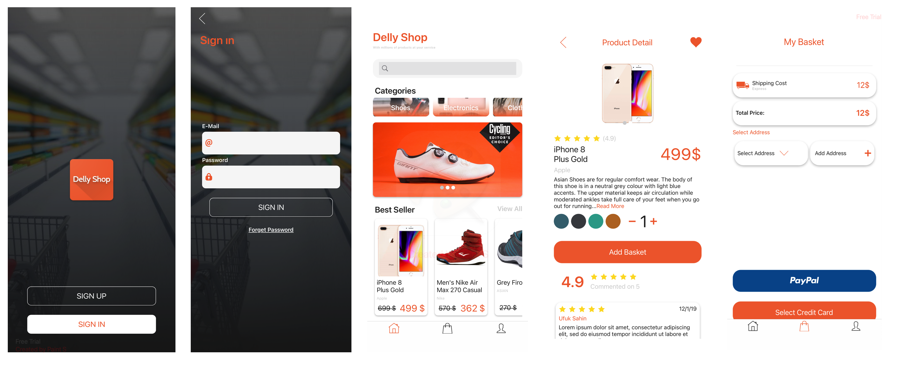

# Point of Sale (Demo App)

This app demonstrates various techniques for building a desktop and mobile application that takes advantage of native platform features, and adapts to a wide range of device needs all from a single codebase. This is NOT a complete application.

### Credits

* Plugin.FirebasePushNotification: https://github.com/CrossGeeks/FirebasePushNotificationPlugin
* PayPal.Forms: https://github.com/AlejandroRuiz/PayPal.Forms
* Plugin.Multilingual: https://github.com/CrossGeeks/MultilingualPlugin
* Plugin.PayCards: https://github.com/CrossGeeks/PayCardsPlugin
* Xam.Plugins.Settings: https://github.com/jamesmontemagno/SettingsPlugin
* Xamarin.Essentials: https://github.com/xamarin/Essentials
* Xamarin.FFImageLoading: https://github.com/luberda-molinet/FFImageLoading
* Xamarin.Forms.Visual.Material: https://www.nuget.org/packages/Xamarin.Forms.Visual.Material
